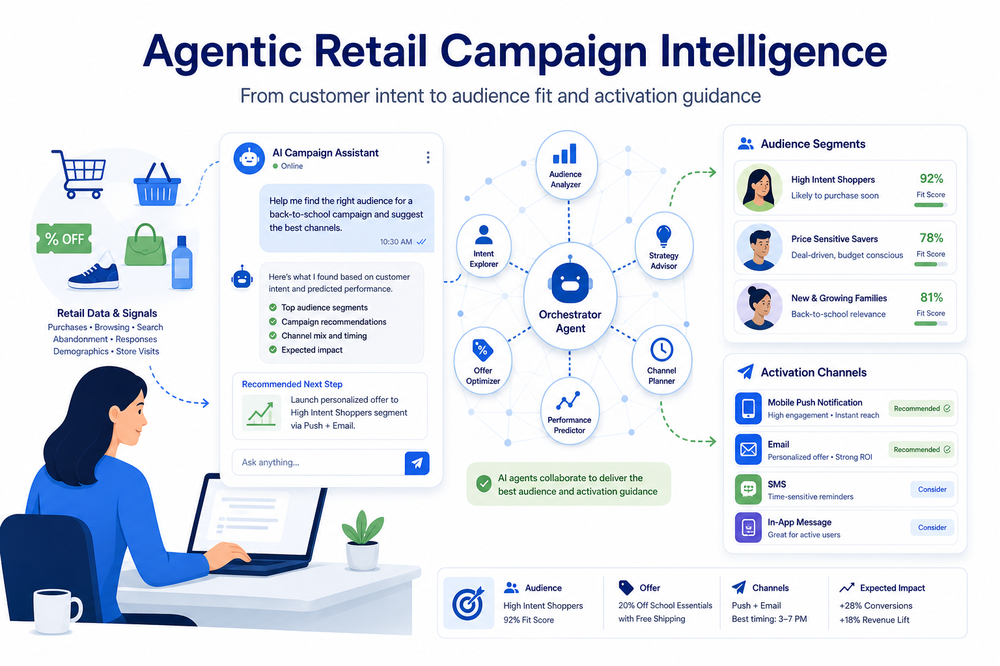
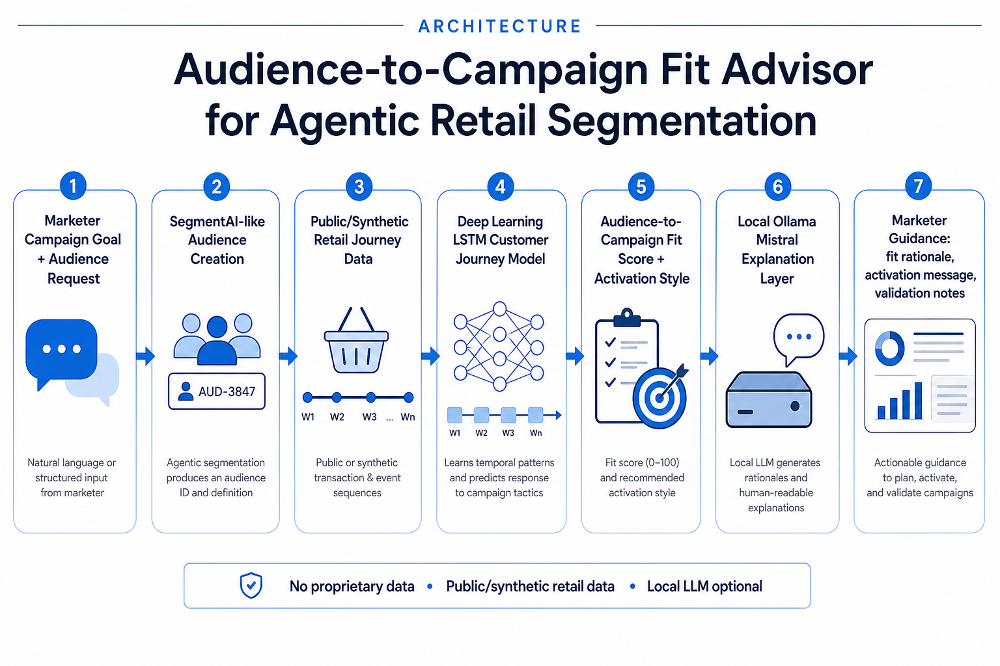

# Audience-to-Campaign Fit Advisor for Agentic Retail Segmentation



**Author:** Marwah Faraj  
**Project type:** Individual capstone  
**Repository purpose:** Final project codebase, reproducible analysis, and demo application

Capstone prototype for advising whether an AI-generated retail audience fits a marketer's campaign objective and which activation style should be used.

The project is inspired by retail marketing workflows where a marketer already has a campaign goal and asks for an audience segment in natural language. Instead of rebuilding the segmentation agent, this prototype focuses on the post-segmentation decision:

> Once the audience exists, does it fit the campaign objective, what activation style should be used, and why?

## Why This Project

Agentic segmentation systems are useful when they can translate marketer intent into an audience. The next layer of value is decision support: understanding customer journey signals inside that audience, validating fit against the known campaign objective, and recommending the most appropriate activation style.

This project uses public or synthetic retail transaction data to avoid any proprietary company data.

## What It Builds

- A retail data pipeline using the public `completejourney` grocery dataset when available.
- A synthetic retail fallback dataset for demos and development.
- Customer journey sequences from weekly purchase behavior.
- A PyTorch LSTM model trained from scratch to classify campaign activation style.
- Traditional ML baselines for comparison (KNN and random forest).
- Hyperparameter optimization for the LSTM.
- A Streamlit app that simulates a SegmentAI output and evaluates audience-to-campaign fit.
- A free local Ollama + Mistral explanation layer that turns model signals into marketer-friendly guidance.

## Activation Style Classes

The model predicts one of six activation styles:

- New customer onboarding
- Win-back reminder
- Price-led coupon
- Cross-sell bundle
- Loyalty reward
- Seasonal spotlight

## Project Architecture



```text
Public/synthetic retail data
        ↓
Weekly customer journey sequences
        ↓
PyTorch LSTM strategy classifier
        ↓
Segment-level probability aggregation
        ↓
Marketer-facing Streamlit app
        ↓
Audience-to-campaign fit guidance + explanation
```

## Setup

```bash
python -m venv .venv
source .venv/bin/activate
pip install -r requirements.txt
```

## Reproduce The Full Capstone Pipeline

Run these commands from the project root to regenerate all analysis artifacts used in the report and presentation.

Fast reproducible run (synthetic data):

```bash
python scripts/01_data_cleaning_eda.py --synthetic-only
python scripts/02_model_training_evaluation.py --synthetic-only --epochs 3
python scripts/03_model_optimization.py --synthetic-only --epochs 1
python scripts/04_pipeline_analysis.py
streamlit run app.py
```

Public dataset run (falls back to synthetic data if download/parsing fails):

```bash
python scripts/01_data_cleaning_eda.py
python scripts/02_model_training_evaluation.py --epochs 6
python scripts/03_model_optimization.py --epochs 2
python scripts/04_pipeline_analysis.py
streamlit run app.py
```

After running the pipeline, review these generated outputs:

| Output type | Location |
| --- | --- |
| EDA figures | `reports/figures/eda_*.png` |
| Model evaluation figures | `reports/figures/model_*.png`, `reports/figures/optimization_*.png` |
| Metrics tables | `reports/tables/*.csv`, `reports/tables/*.json` |
| Analysis summaries | `reports/*_summary.md` |
| Trained model artifacts | `artifacts/` (generated after training) |
| Cleaned transactions | `data/processed/` (generated after EDA) |

## Run The Demo App Only

```bash
streamlit run app.py
```

Example marketer prompts:

```text
Create me a segment of game day heavy shoppers for a seasonal campaign
Find lapsed snack buyers for a win-back coupon campaign
Audience of loyal dairy shoppers for a weekend bundle campaign
```

## Optional Free Local LLM

The app can use **Mistral 7B through Ollama** for marketer-friendly explanations. This is free and local, so it does not require a paid API key.

```bash
brew install ollama
ollama pull mistral
ollama serve
```

Then turn on **Use local Ollama Mistral if running** in the Streamlit sidebar.

If Mistral is too heavy for your laptop:

```bash
ollama pull llama3.2:3b
export OLLAMA_MODEL=llama3.2:3b
```

## Capstone Framing

**Title:** Audience-to-Campaign Fit Advisor for Agentic Retail Segmentation

**Research question:** Can customer purchase sequences be used to evaluate audience-to-campaign fit and recommend activation styles for AI-generated retail segments in a way that is accurate, explainable, and useful to marketers?

## Final Deliverable Locations

This repository supports all three major capstone deliverables:

| Deliverable | Location in this repo |
| --- | --- |
| Final project codebase | Root directory, `src/`, `scripts/`, `app.py` |
| Report draft materials | `reports/drafts/` |
| Generated report figures/tables | `reports/figures/`, `reports/tables/`, `reports/*_summary.md` |
| Presentation outline and suggested visuals | `reports/drafts/presentation_outline.md`, `assets/`, `reports/figures/` |
| Requirement mapping document | `docs/capstone_requirements_map.md` |

Suggested presentation visuals:

- `assets/audience_campaign_fit_architecture.png`
- `reports/figures/eda_top_categories.png`
- `reports/figures/eda_weekly_sales.png`
- `reports/figures/model_comparison.png`
- `reports/figures/model_confusion_matrix.png`
- `reports/figures/optimization_macro_f1.png`

## Complete File Guide

### Application and entry points

| File | Purpose |
| --- | --- |
| `app.py` | Streamlit demo app for audience-to-campaign fit advising |
| `requirements.txt` | Python dependencies |
| `.gitignore` | Excludes local environments, caches, and generated runtime files |

### Runnable capstone scripts

| File | Capstone element |
| --- | --- |
| `scripts/01_data_cleaning_eda.py` | Data cleaning and exploratory data analysis |
| `scripts/02_model_training_evaluation.py` | Model training, baseline comparison, evaluation figures |
| `scripts/03_model_optimization.py` | Hyperparameter search and optimization summary |
| `scripts/04_pipeline_analysis.py` | Representative pipeline input/output analysis |

### Core Python package (`src/campaign_strategist/`)

| File | Purpose |
| --- | --- |
| `__init__.py` | Package metadata |
| `config.py` | Paths, campaign classes, category aliases, dataset URLs |
| `data.py` | Public dataset loading, normalization, synthetic data generation |
| `features.py` | Weekly journey features, weak labels, audience simulation logic |
| `model.py` | PyTorch LSTM model, training, prediction, model save/load |
| `baselines.py` | KNN and random forest baseline models |
| `strategy.py` | Campaign-fit recommendation and optional Ollama explanation |
| `train.py` | Training pipeline used by scripts and the app |
| `viz.py` | Shared report visualization styling |

### Documentation and drafts

| File | Purpose |
| --- | --- |
| `docs/capstone_requirements_map.md` | Maps syllabus requirements to repository files |
| `reports/drafts/introduction_draft.md` | Module 1 introduction draft |
| `reports/drafts/project_management_plan.md` | Module 2 project plan draft |
| `reports/drafts/methods_outline.md` | Methods section outline |
| `reports/drafts/results_outline.md` | Results section outline |
| `reports/drafts/presentation_outline.md` | Final presentation outline |

### Generated analysis outputs (`reports/`)

| File | Purpose |
| --- | --- |
| `reports/data_cleaning_eda_summary.md` | EDA written summary |
| `reports/model_training_evaluation_summary.md` | Model training and evaluation summary |
| `reports/model_optimization_summary.md` | Optimization experiment summary |
| `reports/pipeline_analysis_summary.md` | End-to-end demo case summary |
| `reports/tables/model_comparison.csv` | LSTM vs baseline metrics |
| `reports/tables/optimization_results.csv` | Hyperparameter search results |
| `reports/tables/pipeline_demo_cases.csv` | Example marketer requests and model outputs |

### Assets

| File | Purpose |
| --- | --- |
| `assets/agentic_retail_campaign_hero.png` | README and presentation hero image |
| `assets/audience_campaign_fit_architecture.png` | Workflow architecture diagram |

## Capstone Requirement Coverage

This repository is organized to satisfy the required codebase elements from the final project instructions:

| Requirement | How this repo satisfies it |
| --- | --- |
| Data cleaning | `scripts/01_data_cleaning_eda.py`, `src/campaign_strategist/data.py` |
| Exploratory data analysis | `scripts/01_data_cleaning_eda.py`, `reports/figures/eda_*.png` |
| Model/pipeline design | `src/campaign_strategist/features.py`, `src/campaign_strategist/model.py`, `app.py` |
| Model training | `src/campaign_strategist/train.py`, `scripts/02_model_training_evaluation.py` |
| Deep learning model | PyTorch LSTM in `src/campaign_strategist/model.py` |
| Model optimization | `scripts/03_model_optimization.py`, `reports/tables/optimization_results.csv` |
| Model/pipeline analysis | `scripts/04_pipeline_analysis.py`, `reports/pipeline_analysis_summary.md` |
| Well-organized codebase | Separate `scripts/`, `src/`, `reports/`, and `docs/` directories |
| README documentation | This file |

See `docs/capstone_requirements_map.md` for additional detail.

## Data Notes

The primary public dataset is the `completejourney` retail grocery dataset from 84.51°, available through the open-source R package:

- https://github.com/bradleyboehmke/completejourney
- https://bradleyboehmke.github.io/completejourney/

The project does not require, store, or reference any Walmart data, code, dashboards, customers, or internal architecture.

## Academic Note

The current labels are weak supervision labels generated from interpretable purchase journey rules. This keeps the project feasible for a 7-week capstone while still requiring deep learning model training from scratch. A future extension could replace weak labels with real campaign response labels where approved data is available.

## Repository Notes

- Commit and push this repository using your own GitHub account so authorship reflects your work.
- Do not commit local environments (`.venv/`), caches, or generated secrets.
- Generated model artifacts and processed data can be regenerated using the pipeline commands above.
